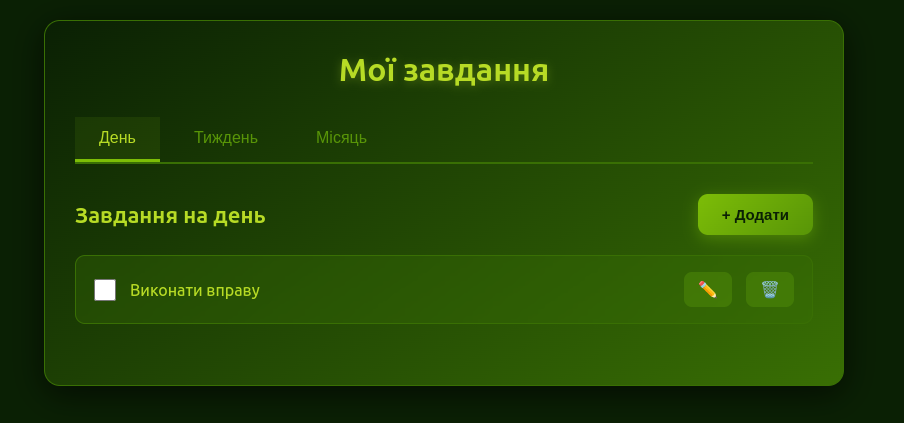

# Todo App (Electron)

Простой планировщик задач на день, неделю и месяц с поддержкой нескольких языков (i18n).

## Возможности

- Вкладки: День / Неделя / Месяц
- Добавление, редактирование и удаление задач
- Сохранение задач в локальный файл `tasks.json`
- Переключение языков (Українська, Русский, English)
- Модальное окно для ввода и редактирования задач
- Кнопка выхода из приложения

## Скриншоты



## Установка для разработки

1. Клонировать репозиторий:

```bash
git clone <URL_репозитория>
cd todo-app
```

## Установить зависимости:

```bash
npm install
```

## Запустить приложение в режиме разработки:

```bash
npm start
```

## Сборка приложения

Проект использует electron-builder, который позволяет собрать приложение для Windows и Linux.

## Linux

```bash
npm run dist
```

В папке dist/ появятся файлы:

TodoApp-1.0.0.AppImage — автономный файл для запуска на любой Linux-системе

linux-unpacked/ — распакованная версия приложения для отладки

## Запуск AppImage:

```bash
chmod +x dist/TodoApp-1.0.0.AppImage
./dist/TodoApp-1.0.0.AppImage
```

## Windows

Сборка Windows-инсталлятора лучше выполняется на Windows.

После установки Node.js и зависимостей:

```bash
npm install
npm run dist
```

В папке dist/ появится:

TodoApp-Setup-1.0.0.exe — инсталлятор для Windows

Примечание: для сборки Windows на Linux можно использовать Wine, но проще собирать на Windows.

## Публикация

Не пушьте папку dist/ в репозиторий.

Для распространения используйте GitHub Releases
, где можно прикреплять .AppImage, .exe и .deb файлы.

Рекомендация по сохранению данных

Для того чтобы tasks.json не терялся при обновлениях приложения:

Храните файл в папке пользователя (~/.config/TodoApp/ на Linux, %APPDATA%\TodoApp\ на Windows).

Для этого используйте Electron API app.getPath('userData').

При первом запуске копируйте шаблон tasks.json в эту папку, а дальше приложение будет работать с пользовательской копией.

## Структура проекта

```bash
todo-app/
├── src/
│   ├── main.js
│   ├── preload.js
│   └── renderer.js
├── index.html
├── package.json
├── tasks.json
└── assets/
    └── images/
        └── img.png
```

## Зависимости

Основные зависимости:

- electron - фреймворк для desktop приложений
- electron-builder - для сборки приложения
- i18next - для интернационализации

## Скрипты

- npm start - запуск в режиме разработки

- npm run dist - сборка приложения для распространения

- npm run pack - создание пакета без установщика
